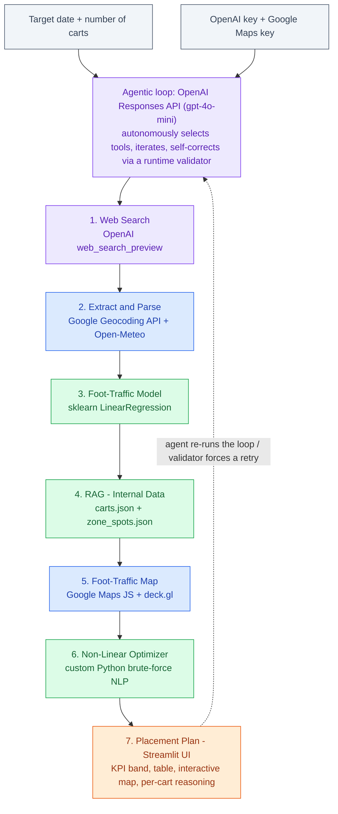
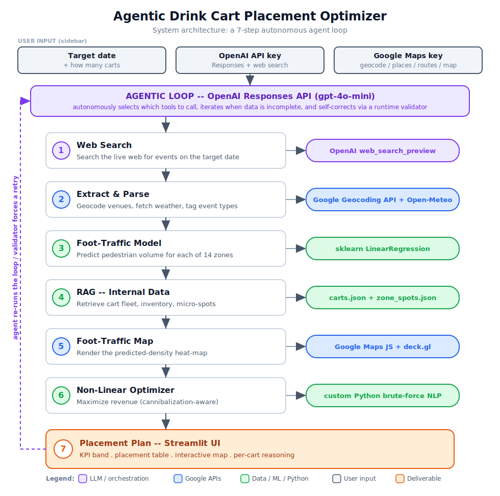

# System Architecture

The **Agentic Drink Cart Placement Optimizer** is built around a single autonomous
agent (OpenAI Responses API, `gpt-4o-mini`) that runs a 7-step loop: it decides
which tools to call, iterates when data is incomplete, and self-corrects via a
runtime validator before producing the final placement plan.

## Diagram (renders on GitHub)



## Static image (for slides / reports)

A scalable vector version lives at [`architecture.svg`](architecture.svg) — open it
in any browser, or embed it directly:



## Colour key

| Colour | Meaning |
|---|---|
| 🟪 Purple | LLM / agent orchestration (OpenAI) |
| 🟦 Blue | Google APIs (Geocoding, Places, Routes, Maps JS) |
| 🟩 Green | Data / ML / Python (regression, RAG store, optimizer) |
| ⬜ Slate | User input from the sidebar |
| 🟧 Orange | Final deliverable (the placement plan) |

## Notes

- **Weather** comes from **Open-Meteo** (free, no key). For dates beyond ~16 days
  out it falls back to a Seattle seasonal average and labels the source accordingly.
- The **heat layer** is rendered by **deck.gl's `GoogleMapsOverlay`**, the supported
  successor to Google's deprecated `visualization.HeatmapLayer`; cart pins and zone
  centroids are native Google Maps markers.

## Regenerating the SVG

The diagram is generated from a small script so it stays in sync with the loop:

```bash
python docs/make_architecture_diagram.py
```

Edit the `STEPS` list in [`make_architecture_diagram.py`](make_architecture_diagram.py)
and re-run to update `architecture.svg`.
